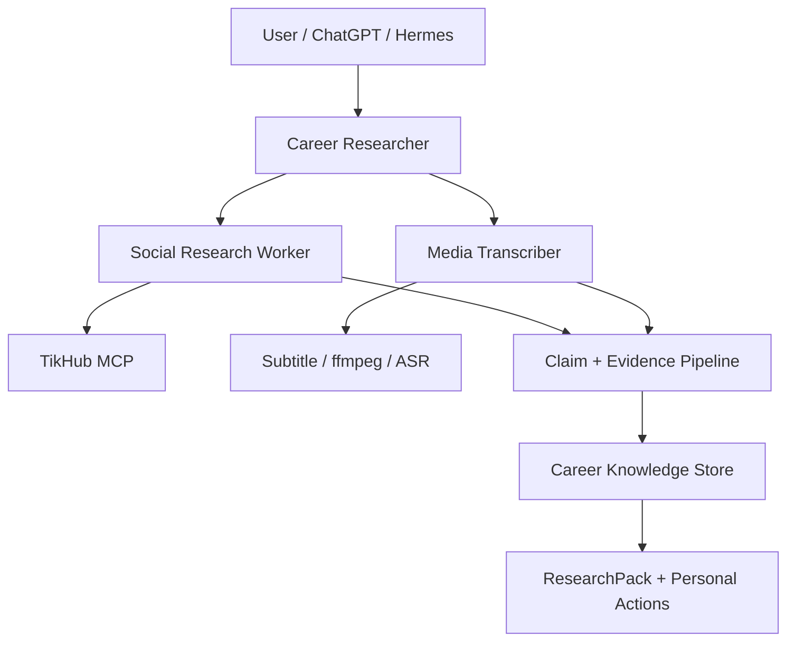

# Architecture

## 边界

- `Social Research Worker` 负责低层平台调用、采样和原始内容归一化。
- `Media Transcriber` 负责字幕/转录，不负责职业判断。
- `Career Researcher` 决定搜索、证据充分度、聚类、分歧与用户行动。
- `Career Knowledge Store` 是跨 Profile 的共享事实源；Hermes Memory 只保存交互偏好和短摘要。
- `UserProfile` 与外部 `Claim/Evidence` 分区，外部观点不能直接覆盖用户信息。

## 当前实现

`src/hermes_career_intelligence` 已包含严格领域模型、Creator 评分、Mock Research Engine、SQLite 持久化和离线 demo。真实 Provider、LLM Claim Extraction、Embedding/RAG 与高层 MCP server 留在后续阶段。

## 目标 MCP Surface

第一版控制在 10 个工具：

1. `research_career_topic`
2. `search_social`
3. `get_content`
4. `get_creator`
5. `transcribe_content`
6. `find_career_creators`
7. `search_career_knowledge`
8. `get_claim_evidence`
9. `get_user_profile`
10. `update_user_profile`

Gap 和 brief 默认作为 `research_career_topic` 输出的一部分，暂不额外扩大 Surface。

