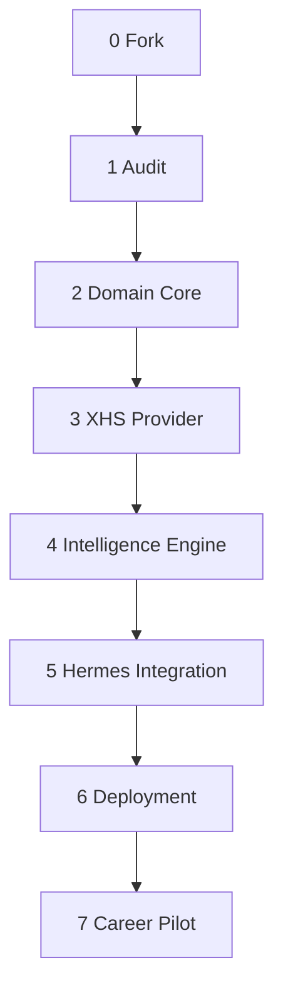

# Multi-stage Roadmap

每个阶段必须独立可验收；缺少 TikHub Key 或服务器时使用 Mock 继续，不阻塞代码与测试。

| 阶段 | 目标 | 主要交付物 | 验收门槛 | 状态 |
| --- | --- | --- | --- | --- |
| 0. Fork 与基线 | 保留 upstream 血缘 | `origin=个人 fork`、`upstream=原仓库`、基线 tag | 可执行 upstream MCP smoke | 已完成 |
| 1. Audit | 明确复用边界 | `AUDIT.md`、架构决策 | REUSE/MODIFY/ADD/REMOVE 完整 | 已完成 |
| 2. Domain Core | 跑通离线闭环 | Models、SQLite、Mock Engine、Demo | Claim 可追踪 Evidence；核心测试通过 | 已完成首版 |
| 3. XHS Provider | 接真实小红书 | Adapter、缓存、归一化、预算控制 | 小样本搜索/详情/Creator/评论可重放 | 进行中：Adapter 已完成 |
| 4. Intelligence Engine | 从内容到可信结论 | Extraction、Ranking、Clustering、Consensus/Conflict/Trend | Mock + 固定真实样本回归通过 | 待开始 |
| 5. Hermes Integration | 可被 Agent 调用 | Career Profile、Skill、10-tool MCP、Kanban 流程 | Hermes 端到端返回 ResearchPack | 待开始 |
| 6. Deployment | 长期低成本运行 | Compose/官方部署、健康检查、备份、日志脱敏 | 重启恢复、无 secret 入库/入 git | 待开始 |
| 7. 真实求职 Pilot | 回答核心问题 | 真实 ResearchPack、30 天行动计划 | 每个重要结论有 Evidence，限制透明 | 待开始 |

## 阶段依赖

## 提交策略

- 每阶段使用 `phase/<number>-<slug>` 分支。
- 一项 Issue 对应一条可验证结果，避免“把模块做好”式大任务。
- PR 必须包含测试结果、成本影响、安全影响和回滚方式。
- upstream 同步单独 PR，不与业务功能混合。
